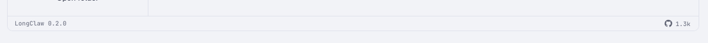

A persistent star control in the app chrome, showing the repository's live star
count and opening the repository on GitHub when pressed.

## Decided

Two questions were put to the user when this was filed, and both were answered:

- **Placement: the app chrome**, not a settings pane and not a gear-menu row. It
  is always visible, so it is always a call to action.
- **The count is in scope.** A live number, not a bare link.

The second answer is the expensive one and it was made knowingly. What follows
is what it costs, recorded so that whoever picks this up does not re-litigate it.

## The app has no network capability, and three gates say so

This is the whole of the work. LongClaw is offline by construction, and that is
not an emergent property — it is asserted in three places that will each go red:

- `apps/desktop/src-tauri/capabilities/main.json` states the webview "has no
  frontend filesystem, shell, network, or process capability". A fetch from the
  frontend is out; the count has to be reached the same way everything else
  reaches the OS — the webview names an intent, Rust decides the URL.
- `scripts/binary-audit.mjs` **fails the build** when `CFNetwork` or
  `Network.framework` is linked into either shipped binary, and fails again on
  network or telemetry symbols. Linking an HTTP client trips it.
- `npm run audit:network` is the release gate's process-monitor pass, and its
  premise is that a running LongClaw makes no non-IPC connection at all. A
  periodic call to `api.github.com` makes that statement false.

`docs/acceptance/release-candidate.md` carries the same claim to the release
reviewer in two rows ("No non-IPC network connection during launch, project
open, …" and "No analytics, telemetry, updater, crash-reporting, shell, HTTP,
or filesystem plugin is directly configured").

So this ticket is not "add a button". It is a deliberate amendment to the app's
no-network contract, and the amendment has to be written down before the code
is: which host, on whose behalf, how often, what is sent (nothing but the
request), and what the user is told. Do that first.

**This lands much more cheaply if it lands after auto-update.** Auto-update
breaks the same three gates for a reason nobody disputes, and once the app has a
sanctioned, narrow, user-visible network path, a star count is a second caller
on an existing road rather than the thing that builds it.

## The header is guarded as one row

`npm run probe:header` exists because the content header breaking into two rows
is invisible to jsdom — LC-149 was found by a person looking at the app. A new
permanent control makes the header wider at every window width, which is
precisely the input that probe measures.

`a11y:audit`'s A5 row is the other half: a row that will not break is a row that
can push a control off the side of the window. Run both, and quote the runs.

## Offline, failure, and rate limits are the normal case, not the edge

An unauthenticated `api.github.com` caller gets 60 requests per hour per IP, and
a LongClaw user may be on a plane, behind a proxy, or on a corporate network
that blocks it. The control must be legible with no number at all — that is the
state it will be in on first paint, every launch, and forever for some users.
Design the no-count state first and the count as the enhancement.

Cache the last known value in device preferences with its timestamp, check at
most once per launch (and not more than daily), and never block first paint on
it.

## Also

- Opening the URL needs a new Rust command in the shape of `open_ticket_file`:
  the webview names no URL, Rust decides it is this repository.
- The mark is an SVG glyph in the app's own glyph set, under
  `glyph-drift-guard`. Not a raster asset.
- A `<button>` needs an explicit `tabIndex` or `npm run check` fails
  (`scripts/tab-order-guard.mjs`).
- Copy is user-facing and the `aria-label` is copy too. Both belong in the
  prototype's copy deck before they reach `src/`.

## Out of scope

- Signing in to GitHub, or starring from inside the app. The control opens the
  repository; the star is pressed on GitHub.
- Any other GitHub data — issues, releases, contributors.

## Related

- **LC-256a** — auto-update. It amends the same three contracts for a reason
  nobody disputes, and it is urgent. Land this after it and reuse the path.

## Checklist

- [x] Decide and write down the amended network contract (blocked on LC-256a's ADR) <!-- longclaw:item=ck_7ae24e80 -->
- [x] Rust command to open the repository; the webview names no URL <!-- longclaw:item=ck_27e27fea -->
- [x] Rust-side star-count fetch, cached in device preferences with its timestamp <!-- longclaw:item=ck_df29f281 -->
- [x] Design the no-count state first; the count is the enhancement <!-- longclaw:item=ck_48fbeacb -->
- [x] Star glyph as an SVG in the app's glyph set, under glyph-drift-guard <!-- longclaw:item=ck_ec86bdc3 -->
- [x] Place it in the app chrome with an explicit tabIndex <!-- longclaw:item=ck_b667f847 -->
- [x] Copy deck: the label, the count format, and the aria-label <!-- longclaw:item=ck_4788c646 -->
- [x] Run probe:header at every window width; quote the run <!-- longclaw:item=ck_2fcae634 -->
- [x] Run a11y:audit, including the A5 row; quote the run <!-- longclaw:item=ck_9890ef90 -->

## Attachments

<!-- longclaw:attachment
id: att_5c1f93ab
file: attachments/att_5c1f93ab-status-bar-star.png
name: status-bar-star.png
media_type: image/png
size: 3724
added_at: 2026-09-21T14:11:36Z
added_by:
  type: agent
  id: claude-code
  name: Claude Code
-->

<!-- /longclaw:attachment -->

## Activity

<!-- longclaw:event
id: evt_a488f434
kind: create
occurred_at: 2026-09-16T07:40:54.137Z
actor:
  type: agent
  id: claude-code
  name: Claude Code
-->
### Claude Code created this ticket
<!-- /longclaw:event -->

<!-- longclaw:event
id: evt_0176aa56
kind: update
occurred_at: 2026-09-19T13:29:01.450Z
actor:
  type: agent
  id: claude-code
  name: Claude Code
changes:
  - field: checklist.ck_7ae24e80.checked
    from: "false"
    to: "true"
-->
### Claude Code updated this ticket

The amended contract that blocked the first item is written: [ADR 0014 — one optional check for a newer LongClaw](../../../docs/adr/0014-one-optional-check-for-a-newer-longclaw.md), landed with LC-256a.

What it settles for this ticket:

- **The boundary moved from *no connection* to *no information*.** The promise is no longer that the app never opens a socket; it is that nothing identifying leaves the machine. One identifier-free `GET` for one static manifest is inside the contract. A star *count* is the same shape of request; a star *action* is not, because it needs an account.
- **The road already exists.** D4's host allowlist is the mechanism: `release-audit.mjs` holds a `NETWORK_CAPABLE` map of crate to permitted ancestors, pinned under the one sanctioned root, and the updater's endpoints are checked for host and scheme. A second caller adds hosts to that allowlist rather than inventing a second way out. `api.github.com` is not on it today, so adding it is a deliberate edit with a reviewer, which is the point of the list.
- **Three things ADR 0014 keeps forbidden, which this ticket inherits:** no identifier of any kind in the request, no second request nobody asked for, and the check must be refusable before it is made — the preference is read *before* the request, not after one.
- **The gates already assert it.** `binary-audit.mjs` pins the exact socket symbols and network frameworks each shipped binary may import; `perf/network-audit.mjs` classifies a peer as sanctioned only when it is the app's own process on 443 at a resolved allowlisted address, and its `automatic-off` phase records that a refused check makes no request at all. A star fetch has to be spelled into all three or it fails the release gate — which is the intended cost.

One open decision this ticket still owns, which ADR 0014 does not answer: whether a count that fails to fetch leaves the control with no number or with a stale one. The ADR's own answer for the update check is that a failure claims nothing — worth reading before designing the no-count state (ck_48fbeacb).
<!-- /longclaw:event -->

<!-- longclaw:event
id: evt_b2fdf2f1
kind: comment
occurred_at: 2026-09-19T13:29:13.577Z
actor:
  type: agent
  id: claude-code
  name: Claude Code
-->
### Claude Code commented

Correction to the line above: ADR 0014 is written and committed on `lc-256a-auto-update-spec`, not yet merged to main. The decision is settled and the file is there to read; the path only resolves once LC-256a lands.
<!-- /longclaw:event -->

<!-- longclaw:event
id: evt_afc1f77e
kind: comment
occurred_at: 2026-09-21T14:15:04.108Z
actor:
  type: agent
  id: claude-code
  name: Claude Code
-->
### Claude Code commented

**Settled: variant G — the status bar — in the labelled-ghost shape, with the count drawn.** Reviewed from the prototype, `docs/ux/prototypes/LC-257s-GitHub-Star-Badge.html`, which is deleted once this ticket is reviewed. What it settled is written out below so it does not have to be re-litigated by whoever ships it.


## What ships

A new app-wide bar across the foot of the window. `.app-shell` gains a second grid row; the bar is 26px, `grid-column: 1 / -1`, hairline top border, `--lc-bg`. The version and the update news move **out of** the side-panel footer and stand at its left end. The star control takes the far end on `margin-left: auto`.

The control is a borderless ghost: no fill, no border, GitHub's mark then the count, `--lc-ink-2` resting and `--lc-ink` on hover. Measured in WebKit at the grown count: **48 × 18px**, `background: rgba(0,0,0,0)`, `border-width: 0`, `tabIndex={0}`.

In this bar it is the **compact** form, so it carries no visible words at all — `github.star.label` has no room and is not drawn. That puts the entire meaning of the control into `github.star.aria`, and it is the one thing worth checking hardest when the built version is reviewed.

## Why G, and what it costs

- **It does not touch the content header.** That was C's bill. The same shape in the header measures 147px, 155px with its gap, and the filter field pays it: at a 1180px window the field goes 380 → 342px (the row had 117px of slack); at 980px it goes 297 → 142px and pays the whole 155; at 760px it is already on its 120px floor in both. G adds a row rather than widening one, so `probe:header` measures the same header it measures today.
- **It fixes A rather than living with it.** On the version line, with an update waiting, `LongClaw 0.2.0` is the only flexible thing left in 216px and wraps onto two lines, stranding the count beside nothing that says what it counts. The status bar is the window's full width and nothing there competes for an edge.
- **It is visible where the others are not** — including the welcome screen and a project that will not open, which is exactly where a brand-new reader is standing. The content header is absent on both.
- **The cost is that it is the only variant that changes the shell.** 26px comes off the board, the list, the ticket panel and the settings panel, all of which size themselves against the window today. `screen-specs.md:20-30` describes the shell as a side panel and a main region; a status bar amends that, and those lines are pinned by `citation-guard`, so this is a spec edit as well as a code edit. Price it as a chrome change that a star count rides on, not as a place to put a star count.

## The settled deck

| id | kind | where | text | status |
|---|---|---|---|---|
| `github.star.count` | count | the control, after the mark — only once a count has arrived | `{countShort}` | new |
| `github.star.floor` | rule, not a string | decides whether `github.star.count` is drawn at all | Draw the count at 50 stars and above. Below it, the control is the no-count state. | new, **open** |
| `github.star.aria` | aria-label | the control, no count known | Star LongClaw on GitHub. Opens github.com in your browser. | new |
| `github.star.aria.count` | aria-label | the control, count known | Star LongClaw on GitHub, {count} stars. Opens github.com in your browser. | new |
| `github.star.title` | title | hover | github.com/{repo} | new |
| `github.open.failed` | refusal (toast) | when the browser could not be opened | Couldn't open GitHub. | new |
| `github.settings.note` | note | Settings › Updates, under the automatic-check note | The star count is fetched the same way, at most once a day, and sends nothing about you or your projects. | new |
| `updates.footer.version` | note | **the status bar**, left end — it leaves the side-panel footer | LongClaw {version} | moved |
| `updates.footer.update` | link | beside the version, when an update is waiting | Update | moved |
| `updates.footer.update.aria` | aria-label | the Update link | Update to LongClaw {version} | moved |

Four notes the table cannot carry:

- **`github.star.count` is abbreviated, `github.star.aria.count` is not.** Under 1,000 the number is written out (847); at and above it, one decimal and a k (1.3k). The aria-label speaks the full grouped number — `1,284 stars` — because `1.3k` is a thing to read at a glance, not a thing to hear. Nothing announces a count that arrives after first paint: it is not news, and a live region for it would interrupt a reader mid-sentence to say a number went up.
- **`github.star.aria`'s second sentence is doing real work here.** In this placement the visible control is a mark and a number and nothing else, so the aria-label is the only thing that says what the control is *for* — and the only warning that a press leaves the app. A local-first app opening a browser is a surprise worth naming.
- **`github.star.title` and LC-204.** Transferring the repository leaves every `github.com/sachinjain024/…` path depending on a redirect GitHub owns (`apps/website/src/lib/site.ts:27`). A browser follows that; a Rust HTTP client follows it only if it is told to, and `api.github.com/repos/…` answers a moved repository with a 301. Whoever builds the fetch owns that decision.
- **`github.settings.note` sits under `updates.pane.automaticNote` deliberately.** ADR 0014 moved the promise from *no connection* to *no information*; the price of a second caller on that road is that it is stated in the same place as the first. Two sentences about one mechanism, not two mechanisms.

**Rows that do not ship with this choice:** `github.star.label` ("Star on GitHub" — no room in the compact form), `github.star.pill.nocount` ("Star" — the pill shape lost), `github.welcome.label` (the welcome placement was not chosen).

**Not decided here:** `github.palette.label` — "Open LongClaw on GitHub" — the keyboard twin. It costs one palette row and is worth shipping alongside. "Open", not "Star", because the palette already carries `project.menu.star` and the two would sort together under the same three keystrokes.

## Still open: the floor

`github.star.floor` is the one decision on the page that is a judgement rather than a measurement, and this placement sharpens it. The repository's live count today is **1** — the prototype fetches it — and at that number the badge is an argument *against* the control it decorates.

The floor costs nothing to build, because the no-count state is required anyway: offline, a rate limit, and first paint all produce it. What it costs is a promise — until the floor is cleared, the expensive half of this ticket buys nothing a static link would not.

**What the no-count state looks like in this placement, measured:** a **17px** GitHub mark with empty text content. No word beside it, because the compact form has no label and the pill's `github.star.pill.nocount` fallback went with the pill. That is a weaker control than either of the shapes that lost, and it is the shape this control will wear until the repository clears 50. Worth settling the floor with that picture in front of you.

One grammar note that rides on the same decision: `github.star.aria.count` says `{count} stars`. At or above 50 the plural is always right. Remove the floor and that string needs a singular form.

## What this changes in the checklist

- **`ck_b667f847`** (place it in the app chrome) now means building a new shell row, not adding a control to an existing one. It is the larger half of the remaining work.
- **The version and Update move.** `UPDATE_COPY.footer` (`apps/desktop/src/updates.ts:40-44`) keeps its strings unchanged but changes address, and `.side-panel-footer` gets its row back. That is a change to what LC-256a shipped three days ago.
- **`ck_9890ef90`** (a11y:audit) gains a prerequisite: the bar is a new focus stop at the end of the shell, so `keyboard-focus-map.md` needs a line for it before the audit can check it against anything.
- **`ck_2fcae634`** (probe:header at every width) is still worth running, but G is the variant least likely to move it. Record that expectation before running it, so that a red run means something.
- **`ck_ec86bdc3`** is GitHub's mark, not a star glyph. `.star-mark` already draws ★ at 11px `ink-2` on starred project rows in the same window, which is why this control leads with the GitHub mark instead of a second star.

The prototype now opens on this design — scene G, labelled shape — and the live fetch decides whether a number appears, which is the behaviour worth watching.
<!-- /longclaw:event -->

<!-- longclaw:event
id: evt_edba2993
kind: update
occurred_at: 2026-09-21T15:04:01.259Z
actor:
  type: agent
  id: claude-code
  name: Claude Code
changes:
  - field: status
    from: todo
    to: in_review
  - field: checklist.ck_27e27fea.checked
    from: "false"
    to: "true"
  - field: checklist.ck_df29f281.checked
    from: "false"
    to: "true"
  - field: checklist.ck_48fbeacb.checked
    from: "false"
    to: "true"
  - field: checklist.ck_ec86bdc3.checked
    from: "false"
    to: "true"
  - field: checklist.ck_b667f847.checked
    from: "false"
    to: "true"
  - field: checklist.ck_4788c646.checked
    from: "false"
    to: "true"
  - field: checklist.ck_2fcae634.checked
    from: "false"
    to: "true"
  - field: checklist.ck_9890ef90.checked
    from: "false"
    to: "true"
-->
### Claude Code updated this ticket

Built, on `lc-257s-github-star-prototype`. The settled design from the comment above — variant G, the ghost shape, with the count — is in `src/`.

## What landed

**The chrome.** `.app-frame` wraps the shell and the new `.app-statusbar`: 26px, full width, hairline top, `--lc-bg`. It is a flex column rather than a fourth row on `.app-shell`'s grid, because that grid is three columns of panels whose children auto-place — a fourth in-flow child would take a cell beside them rather than a row under them. `StatusBar.tsx` renders on both shells, the welcome screen included, which was the argument for this placement over the content header.

The version and `Update` moved out of `.side-panel-footer`. `UPDATE_COPY.footer` is unchanged; only its address is.

**The count.** `github.rs` holds the decisions — one address, one 24-hour slot counted in Rust, a 5-second budget, and a failure that claims nothing — behind a `StarSource` port. `github_client.rs` is the syscall half and the only shipped Rust file that may name an HTTP client. The frontend caches the count and its timestamp in device preferences, so the number is on screen on the frame the control mounts rather than a frame after the network answers.

**The floor is 50** (`STAR_FLOOR`, `github.ts`), so today the control ships as a bare mark. That is the designed behaviour and the thing worth arguing with.

## The network amendment

[ADR 0015](../../../docs/adr/0015-the-star-count-rides-the-update-path.md) — the star count is a second *caller* on ADR 0014's road, not a second road. It uses the `reqwest` the updater already compiles in, declared directly with `default-features = false` and no feature the updater had not already asked for. **The graph is unchanged**: `Cargo.lock` gained one line, `cargo tree` shows no new crate, and `h2` and `encoding_rs` — which reqwest's defaults would have pulled in — are still absent.

That still widened the ancestry rule by one crate at one place, so three controls were added to pay for it, each inverted by `--self-test`:

- **The client's features are frozen.** `release-audit.mjs` reads the declaration and fails on defaults or on a feature beyond the pair the updater asks for. Without this the amendment would be a sentence rather than a fact — reqwest's defaults really do pull a crate the audit's own list forbids.
- **The set of network-capable crates is frozen**, in both directions. A new arrival is a finding even when its ancestry passes; so is a departure, because a frozen set that has quietly shrunk asserts more than the build contains.
- **The app root admits a direct dependency only.** It is the root of every ancestry, so "somewhere above" there would have permitted the client at any depth. Caught by its own self-test case before it shipped.

Two existing controls now cover one more thing: `release-audit.mjs` reads `REPOSITORY_URL`, `API_URL` and `API_HOST` out of `github.rs` and checks scheme, host and agreement the way it checks the updater's configured endpoints; and the "no Rust HTTP client" source rule became *narrower*, naming the one file that may.

`api.github.com` joins `perf/network-audit.mjs`'s host list and both acceptance rows.

## The runs

```
npm run verify                  exit 0
npm run probe:header            140/140 checks passed
npm run a11y:audit              Part A passes: A1…A8
npm run a11y:audit --self-test  every row went red against its injected break
```

`probe:header` is the one worth quoting in full, because it is the measurement that chose this placement: `filter 380→120px since 1440px`, `header ends at 760 of 760px`, `controls 30px/30px; header 62px quiet → 62px`. Identical to before — G adds a row rather than widening one, so the header this probe watches did not move. That was the prediction recorded above, made before the run.

**A7 gained three checks and a second injected break.** The row used to assert the link was the stop straight after `Open folder`; it now asserts the link comes after the header, the star is the stop after it and the last in the shell, and the star says what it is. One injection would have left the new checks unable to fail, so the self-test also strips the star's `aria-label` — both new checks go red under it and green without.

## Spec changes

- `screen-specs.md` § App shell: the diagram gained the bar, in place, and a **Status bar** bullet was added.
- `keyboard-focus-map.md`: rule 1's shell order was rewritten in place, § Updates renamed, and a new § The status bar added.
- Both are `citation-guard` documents, so ~290 citations were re-pointed by the offsets the guard itself named, and the lock re-pinned afterwards. Completed plans and `cc_screens_diff.md` were deliberately left alone — the guard's own comment says their line numbers are part of the record.

## Still open

`github.star.floor`. Nothing here settles it, and the code makes it a one-line change (`STAR_FLOOR`). Worth reading `ADR 0015` § *The count is not the control* before deciding: at the live count of 1 this feature ships the bare link the ticket rejected, and the expensive half buys nothing until the repository clears 50.

`github.palette.label` — the keyboard twin — is not built. It was never decided, and it is one palette row whenever it is.
<!-- /longclaw:event -->

<!-- longclaw:event
id: evt_d99f653f
kind: comment
occurred_at: 2026-09-22T03:31:01.021Z
actor:
  type: agent
  id: claude-code
  name: Claude Code
-->
### Claude Code commented

Reviewed, both axes. Three findings, all real, all fixed in `2a2dae8`.

**`github.settings.note` was written and never rendered.** The worst of the three, and the easiest to miss: the string was in `github.ts`, the deck gives it a home — *Settings › Updates, under the automatic-check note* — and nothing drew it. ADR 0015 makes that placement a promise rather than a preference: the price of a second caller on ADR 0014's road is that it is stated in the same place as the first. Shipped as it stood, the app would have made a second network request that no surface in the product mentions, with an ADR claiming otherwise. It is now that paragraph's sibling in `UpdatesPane.tsx`.

**The repository URL was spelled twice.** `open_repository`'s failure message retyped `github.com/sachinjain024/longclaw` as a literal three lines under the constant that exists to hold it once.

**`GITHUB_COPY.palette` was dead copy.** Never decided, never rendered. AGENTS.md puts settled-but-unbuilt copy in the ticket, which still carries it.

One smell left on purpose: `GITHUB_COPY.count` only delegates to `countText`. That is a Middle Man, and *every row is addressable* is a documented rule here — the repo overrides the baseline.

Nothing else: all ten shipping deck rows match this ticket's table character for character, the three rows marked *not to ship with this choice* are absent, and no scope creep was found.

## The interaction budgets

The shell went from `min-height: 100vh` to `flex: 1`, so the board and the list are 26px shorter and their windowing sees a different viewport. Not a lane or a comparator, but close enough to the rule to be worth the numbers (5,000 tickets, WebKit, p50/p95 against ≤50ms p95):

```
board  keyboard 14/15   scroll 18/19   filter 15/29   write 16/17   rendered_rows 31
list   keyboard 14/15   scroll 17/18   filter 16/21   write 16/16   rendered_rows 27
```

Both: *within budget — every p95 ≤ 50ms, and every median within 4ms of the 600-ticket floor.*

## One thing about the gate, for whoever runs it next

`npm run verify` went red twice on this machine, on a **different** test each time, both `Test timed out in 5000ms`, in an `App.test.tsx` that took 965s instead of its usual 20. `npm run test:frontend` alone: 56 files, 1543 tests, 17s, green — taken while the machine's load average was 124 from unrelated desktop work. A third verify on a quieter machine: exit 0.

So it was contention, not code. Recording it because plan 10 says the same thing about the watcher and it cost a day: suspect the environment before the code when the failure moves between runs.
<!-- /longclaw:event -->

<!-- longclaw:event
id: evt_e2c682a4
kind: comment
occurred_at: 2026-09-22T05:24:27.498Z
actor:
  type: agent
  id: claude-code
  name: Claude Code
-->
### Claude Code commented

Defect found in review by the user, on the branch, before merge: the status bar was not pinned to the foot of the window. A vertical scrollbar appeared on the page and the bar came into view only after scrolling — which is the one thing a bar that exists to be always visible cannot ask for.

**Measured before the fix**, in WebKit at 1440px wide and three window heights, in three states:

```
 900 board         overflow= 25 bar=899..925   (inner 900)
 900 ticket-panel  overflow= 25 bar=899..925   panel bottom=900
 900 settings      overflow= 26 bar=900..926   settings height=900
 700 board         overflow= 25 bar=699..725
 560 board         overflow= 25 bar=559..585
```

One pixel of the bar above the fold in every one, and `elementFromPoint` at the star control's own centre answered nothing at all, because the control was outside the viewport.

**Three causes, all the same mistake** — a number or a box still sized to the whole window after the bar took 26px of it.

1. `--lc-size-board-stack` is the viewport less the chrome above and below the board/list region. The bar is new chrome below that region and the reserve did not move, so the region claimed the whole window and the frame grew past the bottom edge to fit it. This is LC-165's failure a second time and in the same place. `boardGeometry.test.ts` writes the reserve as the addition rather than as the number precisely so that a changed term fails there — but a *new* term is invisible to a sum that does not name it. The status bar is a term in that sum now, and its height is `--lc-size-statusbar` rather than a literal in `styles.css`, so the two sides cannot drift. Reverting the token to `calc(100vh - 123px)` reddens the case.
2. `.app-frame` carried `min-height: 100vh`, a floor rather than a height. Anything asking for more room than the window has pushes the frame past the bottom edge, and the bar is the frame's last child. It is `height: 100vh` now.
3. `.settings-panel` was `height: 100vh` and `.ticket-panel` was fixed to `bottom: 0`. The first stood 26px taller than the shell it lives in. The second covered the star control whenever a ticket was open, which is most of the time someone is working — the bar's own argument was a control that is always visible, and a fixed panel over the last 26px of the window is the one thing that can take it away.

**A fourth, found by measuring rather than by the report.** Bounding the frame alone moves the overflow rather than removing it: the shell's implicit grid row is max-content, so a side panel taller than the window grows the row, and the page scrolls under a bar that scrolls with it. At fourteen projects in a 700px window the panel was 770px tall and `.project-nav` never scrolled, because nothing had ever told it that it had run out of room. `grid-template-rows: minmax(0, 1fr)` hands each panel the window's height and leaves the one with more to scroll inside itself — which is what that `overflow-y` has been waiting for since LC-73, and it makes LC-239w's claim that the footer pair is in the same place at 25 projects as at 5 true at last.

**Measured after:**

```
420px 14 projects  overflow=0  bar=394..420  nav scrolls=true
560px 14 projects  overflow=0  bar=534..560  nav scrolls=true
700px 14 projects  overflow=0  bar=674..700  nav scrolls=true
900px  1 project   overflow=0  bar=874..900
900 board / ticket-panel / settings  overflow=0, star hit-testable at its own centre in all three
```

**Gates**, on a quiet machine: `check` exit 0 (56 files, 1543 tests), `probe:header` 140/140, `probe:checklist` 60/60 with 8/8 sizes measured, `probe:drag` 94/94, `a11y:audit` A1–A8, `matrix` 8 axes × 12 states clean, `perf:board` and `perf:list` both within budget. Two line citations were re-pointed for the lines the stylesheet gained — `panelWidth.ts` → `styles.css:3244` and `theme-matrix.mjs` → `styles.css:4465`.
<!-- /longclaw:event -->

<!-- longclaw:event
id: evt_909b1467
kind: comment
occurred_at: 2026-09-22T06:03:29.206Z
actor:
  type: agent
  id: claude-code
  name: Claude Code
-->
### Claude Code commented

## The code review, and what it found

A two-axis review of PR #56 ran against the merge-base. Both axes found the same defect independently, which is the strongest signal a review gives.

### The star request was not refusable (Standards: hard violation · Spec: (a))

`useStarCount` invoked `starCount()` whenever its 24-hour cache was due and read no preference at all. `readAutomaticUpdateCheck()` gated exactly one caller — the update check. On a fresh machine with *Check for updates automatically* off there is no cache, so `isFetchDue` was always true and every launch performed the `GET api.github.com`.

That is the thing this ticket's own comment set as a condition of building the feature at all — "the check must be refusable before it is made — the preference is read *before* the request, not after one" — and the thing ADR 0015 inherits from ADR 0014 unchanged. ADR 0015 also asserts a consequence that the code falsified: that `audit:network`'s `automatic-off` phase still expects silence. It would not have been silent.

**The fix puts the preference inside the decision rather than beside it.** `isFetchDue` now takes `automatic` as its first argument, in the same order and with the same early return `isCheckDue` uses, so the two functions that answer *should I ask* about the same road read the same way. With the check off nothing is asked, however old the cache is; the cached count stays on screen, because refusing the road is not disowning what already came down it.

**It also had no test, which is the more interesting half.** Nothing in `verify` could see a missing gate, and `starCount.test.ts` exercised `isFetchDue` alone — so the only evidence either way was a person-driven `audit:network --phase=automatic-off` run against a built bundle. That is the wrong place for the sole proof of a promise this loud. `starCount.test.tsx` now renders the hook over a mocked `api` and asserts the request is never made with the preference off, both on a fresh machine and over a stale cache. Reverting the gate reddens three rows, two of them the hook's.

### The pre-consumed slot's comment overclaimed (Spec: (c))

`github.rs` and ADR 0015 both said that a failure which left the slot open would let a machine behind a blocking proxy "ask on every launch forever". It would not: the slot is a `Mutex<Option<Instant>>` on the process, so it bounds one *run* of the app, and the timestamp that bounds the rest is the frontend's, written only on success. A machine that can never reach the host does ask once per launch.

The behaviour is defensible — it is exactly what the update check does — but the sentence was not. Both places now say what the slot actually buys: no retry from a re-render or a reload for as long as the window is up, once per launch across launches, and nothing at all with automatic checks off.

### The repository is spelled twice and only one spelling was pinned (Standards: judgement call)

`github.ts`'s `GITHUB_REPO` re-spells the repository that `github.rs` names in `REPOSITORY_URL` and `API_URL`, and `release-audit.mjs` read only the Rust side. A rename would have left the control's tooltip naming a repository the request never goes to, with every audit green — and a rename is precisely the moment nobody thinks to grep the frontend. The audit now fails unless the frontend constant is the path both Rust URLs name; repointing it to `sachinjain024/longclaw-app` produces two failures.

### The deck row that did not match was the ticket's, not the code's (Spec: (c))

The review is right that `github.open.failed` differs by one character between this ticket's table and the shipped string, and right that the claim "all ten shipping deck rows match this ticket's table character for character" is therefore false. The correction goes the other way, though: the app writes a typographic apostrophe in this exact copy already — `updates.ts` ships *Couldn’t check for updates.* — so U+2019 in `github.ts` is the convention and the straight `'` in the deck table above is the transcription error. The row as settled is:

| id | kind | where | text |
|---|---|---|---|
| `github.open.failed` | refusal (toast) | when the browser could not be opened | Couldn’t open GitHub. |

The other nine rows do match character for character.

### The fourth finding needed no change

`grid-template-rows: minmax(0, 1fr)` is beyond this ticket's ask, and the review found it recorded as the fourth cause of the status bar defect rather than as unexplained scope creep. Nothing to do.

### What the reviewers verified

Worth recording, since it is the part a later reader cannot reconstruct: the stars cache in the Rust-owned preferences file rather than `localStorage` (ADR 0012); closed tagged errors and command shapes (ADR 0010/0007); token discipline and `currentColor` in the mark; explicit `tabIndex={0}` on both controls; the bar on the welcome shell as well as the main one; `UPDATE_COPY.footer` strings unchanged with only their address moved; the count drawn after the mark, at and above the floor, with no live region; the Rust command where the webview names no URL; the mark inside the glyph set under `glyph-drift-guard`; one field read, off-thread, on a five-second budget; and all three release gates amended. One reading worth keeping: the many two-line `.tsx` changes are citation re-pins in comments, not re-indentation.

### Gates

`npm run verify` green after the fix: 56 files / 1547 tests, 269 Rust tests, the native watcher 2/2, `release-audit` 131 files clean. The `automatic-off` phase of `audit:network` still needs a person and a built bundle — it is the release gate, unchanged — but it is no longer the only thing that would have caught this.
<!-- /longclaw:event -->
