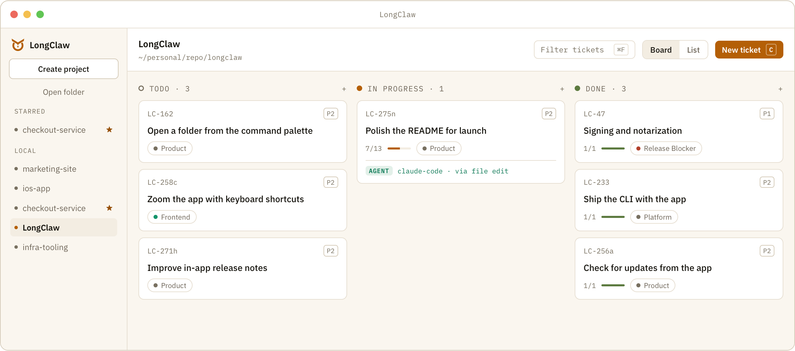

<p align="center">
  
</p>

<h1 align="center">LongClaw</h1>

<p align="center">
  <strong>Local-first issue tracker for AI coding agents.</strong><br>
  Humans plan and stay accountable for tickets. Agents execute and write their
  context back to the same record: Markdown files beside your code.
</p>

<p align="center">
  <a href="https://longclaw.io/#download"></a>
</p>

<p align="center">
  <sub>macOS 13+ · Apple Silicon only · no account required</sub>
</p>

<p align="center">
  <a href="https://github.com/sachinjain024/longclaw/releases/latest"></a>
  <a href="LICENSE"></a>
</p>

<p align="center">
  <a href="https://longclaw.io">Website</a> ·
  <a href="https://longclaw.io/docs/">Install guide</a> ·
  <a href="https://longclaw.io/changelog/">Changelog</a>
</p>

<p align="center">
  
</p>

Built for developers who hand work to coding agents such as Claude Code and
Cursor, and want the plan to live in the repository those agents already read.

The record outlives the app. A ticket is a directory of plain text inside your
project — readable in an editor, diffable in review, and committed with the work
it describes. Nothing requires an account.

**Status: early, in v0.** LongClaw tracks its own development, and it ships
often. The [changelog](https://longclaw.io/changelog/) and the
[release notes](docs/release-notes/) say what each release changed.

## Install

1. **Download** LongClaw for Mac from [longclaw.io](https://longclaw.io/#download),
   or take the `.dmg` from the [latest release](https://github.com/sachinjain024/longclaw/releases/latest).
   Open it and drag LongClaw into Applications.
2. **Open it once.** The app is signed and notarized, so macOS asks one question
   about an app downloaded from the internet. Click **Open**, and it won't ask
   again.
3. **Choose a folder**, usually the repository you already work in. LongClaw
   creates `.longclaw/` inside it and writes nowhere else.
4. **Put `longclaw` on your `PATH`** so agents can file and update tickets. The
   app offers this on first launch, and again any time in *Settings › Command
   line*. Nothing is installed until you press **Install**.

The [install guide](https://longclaw.io/docs/) covers checksums, the dialogs you
should never see, and building from source.

## Completely Secure Local-first app

**No account. No telemetry. LongClaw sends nothing about you, your projects or
your tickets.**

It makes two requests, both to its own GitHub repository and neither carrying
an identifier: a check for a newer version, and the public star count. One
switch in *Settings → Updates* turns both off. With no connection at all, every
feature works the same.

## How it works

**Humans plan, agents execute, and both write to the same file.** An agent
reads a ticket, does the work, and records what it did in that ticket's
`ticket.md`, through the CLI or a plain edit. Here is one, trimmed, from the
ticket that tracks this README:

```markdown
- [x] (Header) Add license and latest-version badges <!-- longclaw:item=ck_d5047e2e -->

<!-- longclaw:event
kind: update
occurred_at: 2026-09-25T10:30:01.427Z
actor:
  type: agent
  id: claude-code
  name: Claude Code
changes:
  - field: checklist.ck_d5047e2e.checked
    from: "false"
    to: "true"
-->
### Claude Code updated this ticket
<!-- /longclaw:event -->
```

**LongClaw notices the write without a refresh.** The card rings, names who
changed it (`AGENT claude-code`), and fades when you open it. If an
agent's write collides with one you haven't seen, a conflict banner shows the
file before anything is overwritten.

## What it does

- **Board and list over the same tickets.** Filter, group and order either one;
  the list stays readable at a few thousand rows.
- **A ticket panel that edits in place.** Markdown descriptions with tables,
  checklists you reorder by drag, and an archive that deletes nothing.
- **Ticket properties when you want them.** Type, due date, start date and
  estimate, each off until a project turns it on.
- **Every project in one sidebar.** Star the ones you live in, drag them into
  order, and jump to any of the first nine with `⌘1`–`⌘9`.
- **Keyboard-first.** `⌘K` reaches every action, `⌘Z` undoes the last one, and
  the whole ticket lifecycle works without a pointer.
- **Human and agent, told apart.** Wherever it matters, you can see who did
  what, in five theme presets across light and dark.
- **Updates from inside the app.** It checks for a new version and downloads
  nothing until you press **Update**.

## How it compares

- **GitHub Issues, Linear.** Hosted trackers, with accounts, sync and teams.
  LongClaw has none of those. Its tickets are files in your repository, so an
  agent reads them the same way it reads your code.
- **Backlog.md.** The closest neighbour: Markdown tasks in the repo, a CLI and
  MCP for agents, and a board in the browser, on macOS, Linux and Windows.
  LongClaw is a native Mac app instead, and each ticket records which human or
  agent changed what.
- **A `TODO.md`.** Nothing to install, and fine until you want statuses,
  priorities, a board, or a record of what the agent changed. LongClaw is that
  file with those added, one directory per ticket.

**Think of LongClaw as a local-first alternative to Linear.** Because the
tracker is files, an agent reads a ticket straight from disk. That is faster
than a round trip to an API, and it costs fewer tokens than the JSON an API
wraps around the same text. Each ticket becomes the context layer for its task:
the full description, the checklist, and the feedback humans recorded along the
way, in one file the agent already knows how to read.

## The `longclaw` CLI

The same crate the window uses also ships as a command-line binary, so key
allocation, the write seams and the file format have exactly one implementation
([ADR 0011](docs/adr/0011-cli-is-the-creation-surface-agents-use.md)). This is
how an agent files and updates work:

**Installing the app installs the command.** The binary ships inside the app,
and step 4 of [Install](#install) puts it on your `PATH`.

```sh
longclaw project init --name "My Project" --key MP
longclaw label add --slug storage --name Storage
longclaw ticket create --title "Fix the retry policy" --label storage \
  --checklist "Reproduce it" --agent-id claude-code --agent-name "Claude Code"
longclaw ticket edit MP-1 --status in_progress --agent-id claude-code
longclaw ticket list
longclaw                       # the full surface
```

Every command prints JSON on stdout and exits non-zero with a typed error on
failure. A label must be defined before a ticket can carry it — the CLI refuses
a slug the project does not define, so a label cannot be created by using it.
**An agent must pass `--agent-id`**: the file format declares an actor
and never infers one, so without it the activity entry claims a human did the
work.

This repository tracks its own work this way. Every `LC-*` item under
[`.longclaw/tickets/`](.longclaw/tickets/) was filed through this CLI, and the
agent-authored entries in those files were written by agents reading the same
contract yours will.

## A project on disk

A project is any folder you choose. The `.longclaw/` directory inside it is what
makes it a LongClaw project, and each ticket is one directory holding one
`ticket.md`. This is the ticket that tracks this README, trimmed:

```markdown
---
format: longclaw.ticket/v1
id: c5710220-c278-4a24-9467-477cda87698b
key: LC-274e
title: "Refine the GitHub README: current status, install path, and a user-first order"
status: in_progress
priority: none
labels:
  - product
created_at: 2026-09-25T08:46:18.691Z
---

The repository README is the first page a visitor to the GitHub repo reads, and
it has drifted from what the project is now. …

## Checklist

- [x] (Header) Add license and latest-version badges <!-- longclaw:item=ck_d5047e2e -->
- [ ] (Comparison) Add a short "How it compares" section … <!-- longclaw:item=ck_5412a4be -->

## Activity

<!-- longclaw:event
id: evt_39afbd02
kind: create
occurred_at: 2026-09-25T08:46:18.691Z
actor:
  type: agent
  id: claude-code
  name: Claude Code
-->
### Claude Code created this ticket
<!-- /longclaw:event -->
```

That one file is the whole record: metadata in the frontmatter, the description
in Markdown, a checklist whose items keep their ids, comments, and an activity
log in which every entry names a human or an agent. Attachments sit beside it in
`attachments/`. The rest of `.longclaw/` is `longclaw.yaml`, holding the
project, its people and its labels, and `AGENTS.md`, generated into every
project so an agent that has never seen LongClaw can edit tickets correctly.

See [the file format](docs/file_format.md) for the contract and
[the user guide](docs/user-guide.md) for project folders, backups, agent setup
and recovery.

## Product principles

- Files on disk are the source of truth.
- The on-disk format is designed for reliable agent reads and writes.
- Humans and agents collaborate on the same tickets, while assignees remain human.
- The desktop experience targets Linear-grade speed and polish.
- Local use requires no account or telemetry.

## Documentation

- [Install guide](https://longclaw.io/docs/) — requirements, first launch, checksums, building from source
- [User guide](docs/user-guide.md) — project folders, backups, agent setup, recovery
- [CLI reference](https://longclaw.io/docs/cli/) — the `longclaw` commands and their flags
- [File format](docs/file_format.md) — the contract for `ticket.md` and `.longclaw/`
- [Release notes](docs/release-notes/) — what each version changed
- [Example agent context files](examples/agent-context/)

## Contributing

Everything below is for working on LongClaw itself.
[CONTRIBUTING](CONTRIBUTING.md) is the full guide: prerequisites, filing work,
branching, and the quality gate every change must pass.

```sh
npm --prefix apps/desktop ci
npm run verify         # the gate — see CONTRIBUTING for what it runs
npm run dev            # launch the app
npm run dev:fixture    # launch with the development fixture registered
npm run build:app      # the production desktop app
```

The website, longclaw.io, is a separate static Astro package in
[`apps/website`](apps/website) with its own README, which covers its layout,
rules, agent skills and deployment.

The architecture decisions, domain language, design docs, agent instructions,
and the planning and evidence behind the project are indexed in
[docs/README.md](docs/README.md).

## License

LongClaw source code is licensed under the [Mozilla Public License 2.0](LICENSE).
